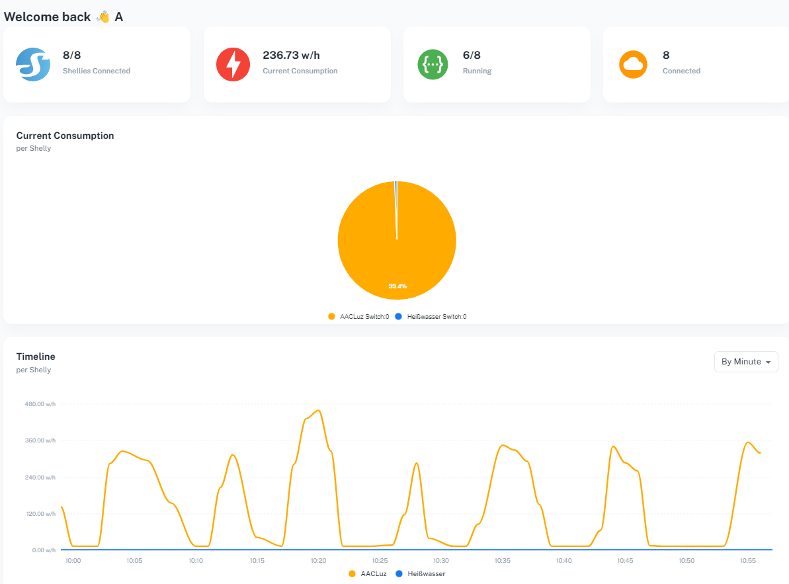
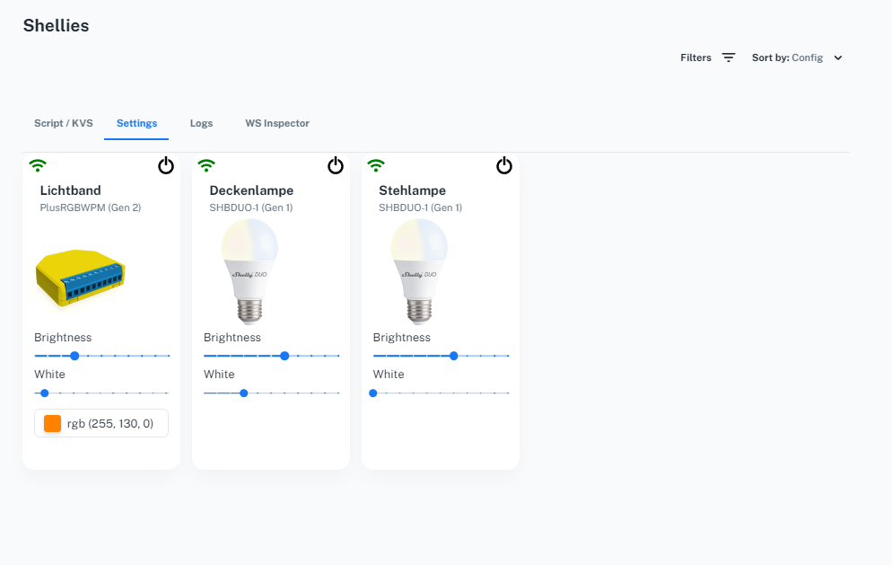
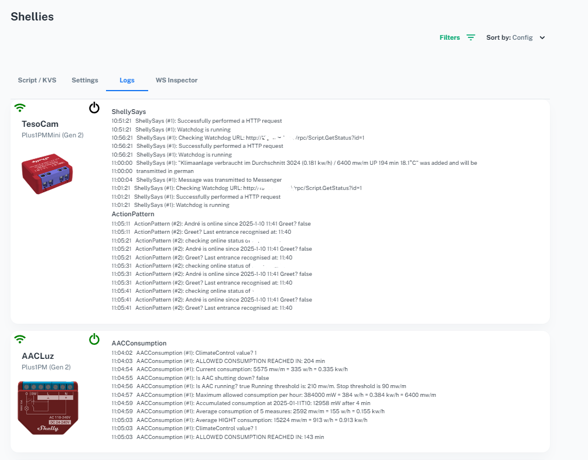
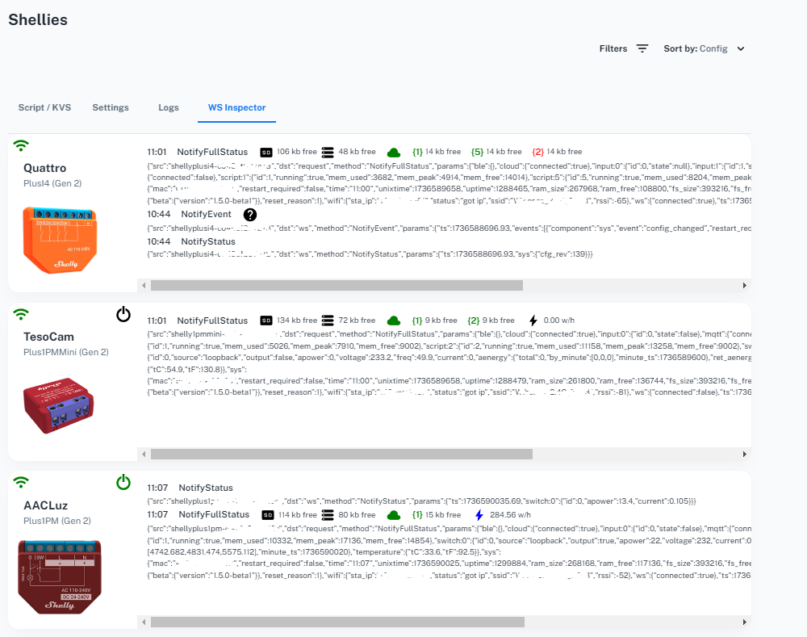
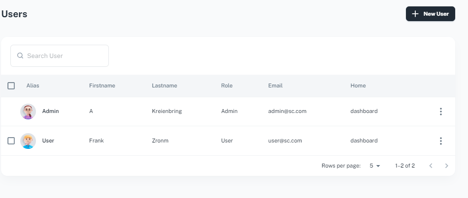

# Shelly Central

Shelly Dashboard / Monitor for 1. / 2. / 3. generation devices

## Overview

Shelly Central is a client (React) / server (nodejs) application to monitor and control your Shelly devices. The server collects all relevant information about your devices by using RPC calls and websocket connections. The client is a webapplication that makes monitoring and controlling your Shellies easy.  
Shelly Central is cloudless. That means it makes you (sort of) independent from the Shelly Cloud Control Center.

The server must run in your local network and acts like a broker between your Shellies and the client application. The communication with the client is strictly websocket based.

## Features
Shelly Central supports English, Spanish and German.

- **Dashboard** 
  Informs you about connected Shellies, current and timelined consumption, running scripts, cloud connection.
- **Shellies** 
  Get insights about KVS values, script status, Logs and websocket messages. Control your switches. Get notified when a script error occures.
- **User** 
  Enable additional users to log in to the appplication.
- **Blog** 
  A simple interface to write internal articles or notes to be displayed on the landing page.

## Why use it?

Managing many Shellies in a network is a challenge. The original Shelly Control app is a good choice. But it is cloudbased. Hence you need an internet connection to control your devices. Shelly Central is needs only Wifi and your local network. It is Open Source and transparent. Your welcome to participate and enhance the features.

## How to install

- **Prerequisites** 
  Install nodejs. Normally it includes the NPM packet manager. I tested the system with nodejs 20.x.
- **Server (Client included)**  
  Download the server release and unzip it in a directory of your choice. E.g. _/sb_ (Shelly Broker). Normally you run the server on a dedicated always-on-system. Like a NAS, a Rasberry or any other OS that can run nodejs. Navigate to that directory and type _npm install_. It might take a while untill all modules are downloaded. In the meantime you could...

  **Configure your Shellies** 
  Add the IP addresses and custom names of your Shellies to the file _/sb/config/devices.json_. An example is included.  
  It is also strongly recommended to change the default values of user, password and secret in _/sb/config/default.json_.

  **Configure the display of KVS values**
  In the file _/sb/config/kvsdisplays.json_ you can map KVS values to display names for convinience. An example is included.

  **Start the server** 

  - Linux: _npm start_
  - Windows: _node shellybroker.js_

  Thats it! Navigate your browser to [YOURSERVERIP]:3031 and log in with *admin@sc.com* and password _undlos_

- **Client** 
  The server release includes the current client version. But if the client version gets updated, you might want to install the newer version. 
  Download the client release and unpack the content into the _/sb/public_ folder.

## How to particpate and join the project

This project needs your help! There are so many Shelly devices and up to now only one developer :-) There is a simple and a developer stylish way to support.

**The simple way** 
Add images to the project. The project works with 1. / 2. and 3. generation Shelly devices. But it lacks images of all the available devices as I personally don't own all of them. The best way (as far as I know) to get your hands on a high quality image of a device is to log in at [Shelly Control](https://control.shelly.cloud) and download the image of a device that is not yet included in the _sc/public/assets/images/devices_ folder. Mind the name of the file as it must fit the modelname.

**The Developer way** 
Fork the whole Github project and start making pullrequests! Your welcome! As with the images I'm sure other devices (I don't own) have special switches, RPC commands, JSON formats etc... Let's enhance this software to support more devices for the sake of all Shelly users!

## The Log feature ##
As of now the log outputs of a Shelly can not directly be associated with the script that produces them :-(
So to get this working you need to preceed every output with the name of the Script. E.g. "logPrefix: [SCRIPTNAME]" where [SCRIPTNAME] equals the name of an existing script!

## When to restart the server ##
The server must be restartet when
- You add / change a device in _/sb/config/devices.json_
- You add / delete a script on a device
- you add / delete a KVS key 

because for performance reasons this information is only retrieved once.

## Screenshots ##

## Thanks! ##
to the [Minimal Dashbard](https://minimal-kit-react.vercel.app/) project: Without it things would have been much harder!